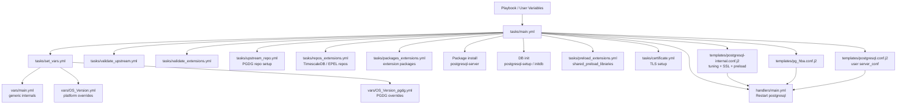

<!-- generated-by: gsd-doc-writer -->
# Architecture

## System overview

The `postgresql` Ansible role installs, configures, and starts a PostgreSQL server on Red Hat
Enterprise Linux family distributions (RHEL 8/9/10, AlmaLinux, CentOS, Rocky), Fedora, and
openSUSE/Leap. The role accepts a small set of user-facing variables (e.g. `postgresql_version`,
`postgresql_password`, `postgresql_extensions`) and produces a running, optionally-tuned
PostgreSQL instance. It supports two mutually exclusive package sources: OS-shipped packages
(AppStream/Zypper) and upstream PGDG packages from the PostgreSQL Global Development Group yum
repository. The role is designed to run both on fully booted systems and inside container build
environments (Buildah, rpm-ostree/bootc), with graceful degradation of features that require a
live systemd runtime.

## Component diagram



## Data flow

A typical role invocation follows this sequence:

1. **Variable resolution** (`set_vars.yml`) — The role detects whether the host is an rpm-ostree
   system and whether systemd is running. It then loads platform-specific variable files in order
   of increasing specificity: OS family → distribution → distribution+major_version →
   distribution+full_version. If `postgresql_use_upstream_packages` is true, an additional
   `_pgdg.yml` var file is loaded, overriding paths, service names, and package names for the
   PGDG layout.

2. **Validation** — Two independent collect-then-fail validators run conditionally:
   - `validate_upstream.yml` runs when `postgresql_use_upstream_packages` is true. It checks
     platform support (RHEL-family only), rejects rpm-ostree systems, enforces a minimum version
     of 16, and detects package conflicts.
   - `validate_extensions.yml` runs when `postgresql_extensions` is non-empty. It verifies that
     every extension has a `name`, that upstream packages are enabled, that unsupported
     combinations (e.g. timescaledb on RHEL 10, postgis on PG 13) are rejected, and that all
     extension names are known.

3. **Repository setup** — If upstream packages are requested, `upstream_repo.yml` installs the
   PGDG repo RPM and disables all PGDG version repos except the one matching `postgresql_version`.
   If extensions are requested, `repos_extensions.yml` adds the TimescaleDB packagecloud.io repo
   (present or absent based on the extensions list) and enables EPEL + CRB when PostGIS is
   requested.

4. **Package installation** — The core `postgresql-server` package (or `postgresql{ver}-server`
   for PGDG) is installed. Extension packages are then installed or removed in
   `packages_extensions.yml`. The package backend switches to `ansible.posix.rhel_rpm_ostree` on
   rpm-ostree systems.

5. **Database initialization** — If `postgresql.conf` does not yet exist, the role initializes
   the data directory using `postgresql-setup --initdb` (or `postgresql{ver}-setup initdb` for
   PGDG). On non-booted container hosts the `systemctl` calls inside `postgresql-setup` are
   patched out via a temporary shell script.

6. **Service management** — The PostgreSQL service is enabled. On booted systems it is also
   started. On container build hosts the service start is omitted.

7. **Configuration** — Three configuration files are managed:
   - `system-roles-internal.conf` (always written) — sets `shared_buffers`, `effective_cache_size`
     (when `postgresql_server_tuning` is true), `ssl = on` (when enabled), and
     `shared_preload_libraries` (when extensions require preloading).
   - `system-roles.conf` (written only when `postgresql_server_conf` is defined) — user-supplied
     key/value overrides.
   - `pg_hba.conf` (written only when `postgresql_pg_hba_conf` is defined) — client
     authentication rules.
   Both generated conf files are linked into the main `postgresql.conf` via `include_if_exists`.

8. **Certificate setup** (`certificate.yml`) — Optionally generates TLS certificates via the
   `fedora.linux_system_roles.certificate` role and symlinks them into the data directory.

9. **Restart handler** — Any configuration change notifies the `Restart postgresql` handler,
   which restarts the service on booted hosts and is a no-op on container build targets.

## Key abstractions

| Abstraction | File | Description |
|---|---|---|
| `postgresql_version` | `defaults/main.yml` | Primary user input; controls which package stream and DB version is used |
| `postgresql_use_upstream_packages` | `defaults/main.yml` | Switches between OS-shipped (AppStream/Zypper) and PGDG package sources |
| `postgresql_extensions` | `defaults/main.yml` | List of dicts describing extensions to install; drives repo, package, and preload phases |
| `__postgresql_packages` | `vars/main.yml`, per-OS overrides | Resolved list of package names to install; overridden by platform var files |
| `__postgresql_is_ostree` | `tasks/set_vars.yml` (set_fact) | Boolean flag: true when `/run/ostree-booted` exists; gates rpm-ostree package backend and guards dnf-specific tasks |
| `__postgresql_is_booted` | `tasks/set_vars.yml` (set_fact) | Boolean flag: true when systemd is active; gates service start, password setting, and SQL script execution |
| `__postgresql_extension_packages` | `vars/main.yml` | Dict mapping extension name to PGDG package base name; used by `packages_extensions.yml` for name construction |
| `__postgresql_preload_required` | `vars/main.yml` | List of extension names that require a `shared_preload_libraries` entry |
| `__postgresql_preload_libraries` | `tasks/preload_extensions.yml` (set_fact) | Computed list of extensions to add to `shared_preload_libraries`; result of three-phase intersect/union/difference logic |
| `__postgresql_postgis_default_by_pg_version` | `vars/main.yml` | Maps PostgreSQL major version to the recommended default PostGIS stream (e.g. `postgis35` for PG 16/17/18) |
| `__postgresql_contrib_only_extensions` | `vars/main.yml` | Extensions bundled in `postgresql{ver}-contrib`; accepted as valid names but skipped during package install |

## Directory structure rationale

```
ansible-postgresql/
├── defaults/          # User-facing role variables with defaults (single main.yml)
├── vars/              # Internal variables; platform-specific files loaded by set_vars.yml
│   ├── main.yml       # Generic internals: package lists, path defaults, extension maps
│   ├── RedHat_8.yml   # RHEL 8: AppStream module-based package names
│   ├── RedHat_9.yml   # RHEL 9: AppStream module or plain package names
│   ├── RedHat_10.yml  # RHEL 10: plain package names
│   ├── *_pgdg.yml     # PGDG overrides: versioned paths, service names, auth method
│   ├── Suse.yml       # SUSE: no postgresql-setup, different cert directory
│   └── AlmaLinux_*/   # Symlinks → corresponding RedHat_* files (same package layout)
├── tasks/             # Ordered task files, each with a single well-scoped responsibility
│   ├── main.yml       # Orchestration: calls all subtask files in order
│   ├── set_vars.yml   # Runtime fact detection and platform var loading
│   ├── validate_upstream.yml    # PGDG precondition checks (collect-then-fail)
│   ├── validate_extensions.yml  # Extension precondition checks (collect-then-fail)
│   ├── upstream_repo.yml        # PGDG yum repository setup
│   ├── repos_extensions.yml     # Extension-specific repos (TimescaleDB, EPEL/CRB)
│   ├── packages_extensions.yml  # Extension package install/remove
│   ├── preload_extensions.yml   # Compute shared_preload_libraries list
│   ├── certificate.yml          # TLS certificate generation and symlinking
│   └── input_sql_file.yml       # Optional SQL script execution
├── templates/         # Jinja2 configuration file templates
│   ├── pg_hba.conf.j2           # Client authentication configuration
│   ├── postgresql.conf.j2       # User-supplied server configuration overrides
│   └── postgresql-internal.conf.j2  # Role-managed tuning, SSL, and preload settings
├── handlers/          # Single handler: restart postgresql service on booted hosts
├── meta/              # Galaxy metadata, platform declarations, collection dependencies
├── molecule/          # Integration test scenarios using containers
├── tests/             # Additional test playbooks
├── examples/          # Example playbooks showing common usage patterns
└── docs/              # Generated and supplemental documentation
```

The flat `tasks/` layout (no subdirectories) reflects the role's linear execution model: each
file corresponds to one phase of the install/configure pipeline and is called in sequence from
`main.yml`. This makes the execution order explicit and the role easy to trace without following
deeply nested imports. Platform variation is handled through variable files rather than task
branching, keeping individual task files clean and platform-agnostic where possible.
